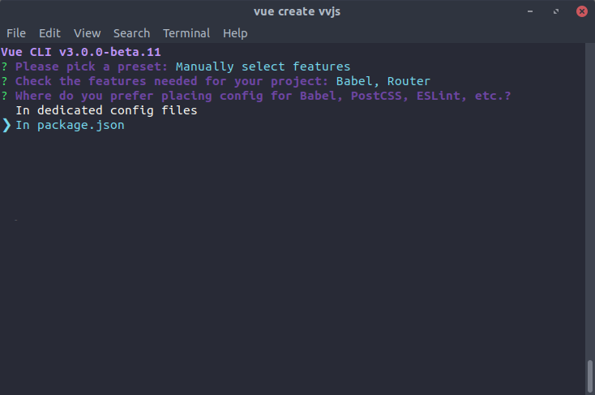

# vue-workshop-demo

> This project is meant to be the end state of a walkthrough of how to get build an beginner web application with Vue JS that connects to an API. It makes use of Vue-cli 3 and vuetify.

## Initial Setup
### Install Vue CLI

To start off with, we'll open our terminal. You'll want to have NPM or Yarn installed. Then you'll want to install vue-cli:

``` bash
# Install .
npm install -g @vue/cli
# or
yarn global add @vue/cli
```

Once that is done you should have the newest 

``` bash
vue -V
```

This should return should be 3.0.0-beta.x. If it does, we're ready to start getting set up. 

### Install the project
Enter the following in your terminal: 

``` bash
vue create vvjs
```

You'll be given a set of options. You will want to "manually" select features. Make sure to add Vuex and Router. Here's the setup that we will use for our installation:

1) Manually select features
2) Vuex and Router should be selected. Press space to select them.

3) Config should be in package.json

4) "n" do not save
5) Use NPM


Once the initial installation is completed, you'll have a working project! You can already see something if you run the following:

``` bash
npm run serve
```

Now go to in your browser. You can press control + C in your terminal to stop the process running this

### Install Vuetify/Babel/Axios

Before we go any further, we're going to install a couple of dependencies to allow us to bootstrap our project a little further. The first of these is Vuetify, which will give us an interface for our project. You won't have to use Vuetify on all of your projects! But it will give us a navigation bar and some basic styling when we first load up our application. Enter the following to see your starting place:

``` bash
cd vvjs
vue add vuetify
```
1) "y" allow Vuetify to replace app.vue and helloworld.vue
2) "y" use custom theme
3) "n" use a la carte components
 "y" use babel/polyfilly


### Add Babel and Axios

There are two dependencies that we'll be adding to the project: Babel, and Axios. Istall them with the following commands.

``` bash
npm install --save @babel/polyfill
npm install --save axios vue-axios
```

Then open src/main.js and add the following:

``` main.js
import router from './router' // Add everything after .router:
import axios from 'axios'
import VueAxios from 'vue-axios'

Vue.use(VueAxios, axios)
```
We'll be moving

## Getting started

### Data models

Open 


## Build Setup

``` bash
# install dependencies
npm install

# serve with hot reload at localhost:8080
npm run dev

# build for production with minification
npm run build

# build for production and view the bundle analyzer report
npm run build --report

# run unit tests
npm run unit

# run e2e tests
npm run e2e

# run all tests
npm test
```

For a detailed explanation on how things work, check out the [guide](http://vuejs-templates.github.io/webpack/) and [docs for vue-loader](http://vuejs.github.io/vue-loader).